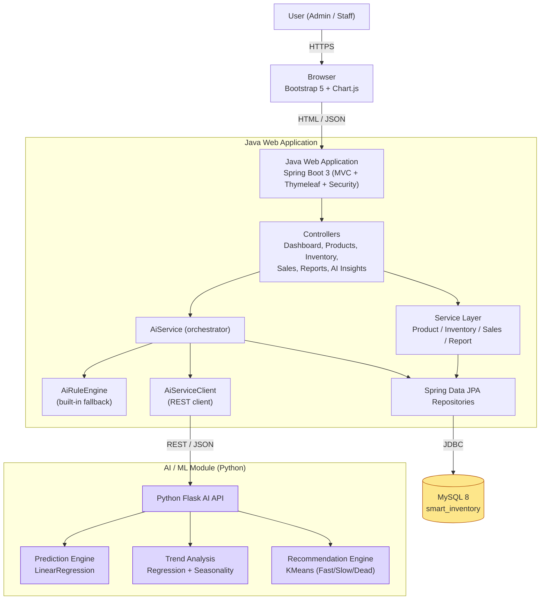
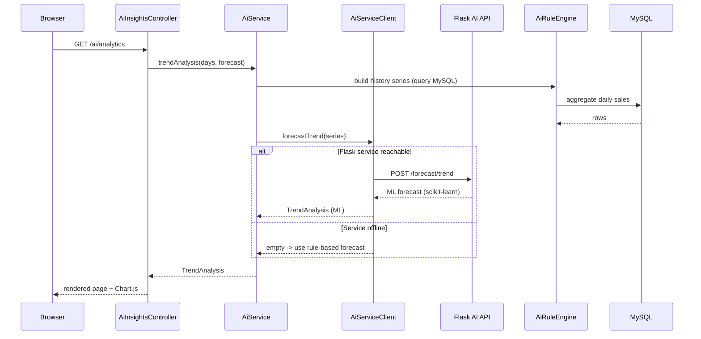

# System Architecture

## High-level architecture

## Request flow (AI insight example)

## Layers

| Layer | Responsibility | Key classes |
|-------|----------------|-------------|
| Presentation | Server-rendered pages + charts | Thymeleaf templates, `app.js`, Chart.js |
| Web / Controller | HTTP routing, view models, JSON for charts | `*Controller`, `ChartDataController` |
| Service | Business logic & AI orchestration | `ProductService`, `SalesService`, `ReportService`, `AiService` |
| AI | ML + rule-based intelligence | `AiRuleEngine`, `AiServiceClient`, Flask `engines/*` |
| Persistence | Data access | Spring Data JPA repositories |
| Database | Storage | MySQL 8 |

## Resilience
The Java app never hard-depends on Python. `AiService` tries the ML microservice
first and **falls back to `AiRuleEngine`** on any error, so all four AI features
work whether or not the Flask service is running.
