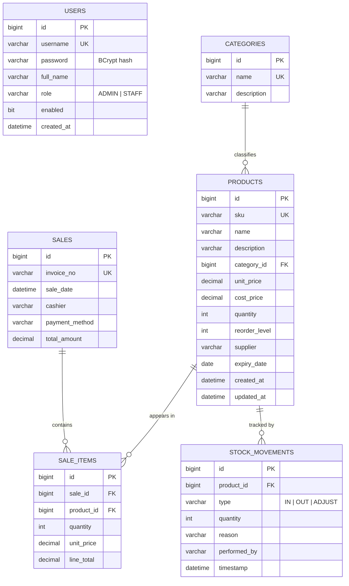

# Entity-Relationship Diagram

## Relationship summary

| Relationship | Type | Meaning |
|--------------|------|---------|
| Category → Product | 1 : N | A category groups many products |
| Sale → SaleItem | 1 : N | A bill contains many line items |
| Product → SaleItem | 1 : N | A product can be sold on many bills |
| Product → StockMovement | 1 : N | Every stock change is logged |

`USERS` is independent (used for authentication); the `cashier` field on `SALES`
stores the username that recorded the sale.
